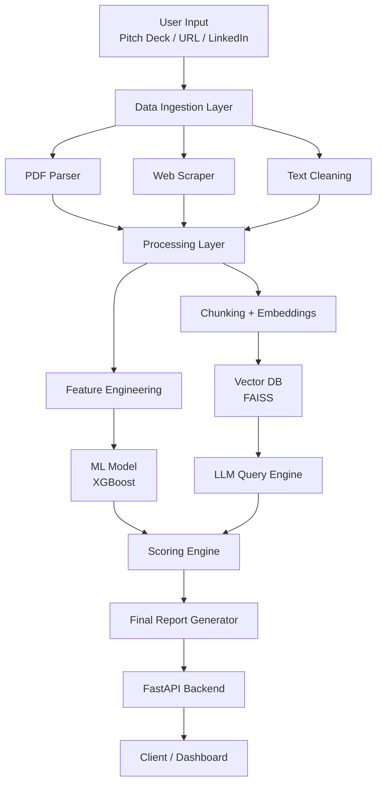

# founder-intelligence-engine

> AI system that evaluates startups using **ML + LLM intelligence**
> Built to simulate how top-tier investors analyze founders, markets, and execution risk.

---

## 🚀 Overview

Founder Intelligence Engine is a **hybrid AI system** that combines:

* 📊 **Machine Learning (XGBoost)** → structured prediction
* 🧠 **LLMs (RAG pipeline)** → qualitative reasoning
* ⚙️ **FastAPI backend** → production-ready APIs

It analyzes:

* Pitch decks (PDF)
* Startup websites
* Founder profiles

And outputs a **multi-dimensional startup evaluation report**.

---

## ✨ Core Features

* 🔍 Pitch deck parsing (PDF → structured text)
* 🧠 LLM-powered startup analysis (strengths, weaknesses, GTM clarity)
* 📦 Retrieval-Augmented Generation (RAG) for contextual reasoning
* 📊 ML-based success prediction (XGBoost)
* ⚖️ Hybrid scoring engine (ML + LLM fusion)
* 🚀 FastAPI endpoints for real-time inference
* 📈 Modular architecture (scalable to production)

---

## 🧱 System Architecture



---

## 🛠️ Tech Stack

| Layer      | Tech Used               |
| ---------- | ----------------------- |
| Backend    | FastAPI                 |
| ML Model   | XGBoost                 |
| LLM        | OpenAI API              |
| Vector DB  | FAISS                   |
| Embeddings | OpenAI Embeddings       |
| Parsing    | PyMuPDF                 |
| Deployment | Docker / AWS (optional) |

---
---

## ⚡ Quick Start

### 1. Clone the repo

```bash
git clone https://github.com/yourusername/founder-intelligence-engine.git
cd founder-intelligence-engine
```

---

### 2. Setup environment

```bash
pip install -r requirements.txt
```

Create a `.env` file:

```
OPENAI_API_KEY=your_api_key
```

---

### 3. Run the API

```bash
uvicorn app.api.main:app --reload
```

---

### 4. Test endpoint

```bash
curl -X POST "http://127.0.0.1:8000/api/v1/analyze" \
-F "file=@sample_pitch_deck.pdf"
```

---

## 📊 Sample Output

```json
{
  "startup_score": 78,
  "founder_strength": 82,
  "market_clarity": 65,
  "risk_level": "High",
  "insights": "Strong technical founder but weak go-to-market strategy."
}
```

---

## 🧠 How It Works

### 1. Data Ingestion

* Extracts text from PDFs and web sources
* Cleans and structures raw input

### 2. Dual Intelligence System

#### A. ML Pipeline

* Feature extraction (experience, traction signals)
* XGBoost model predicts success probability

#### B. LLM + RAG Pipeline

* Text chunking + embeddings
* FAISS vector search
* Context-aware reasoning using LLM

---

### 3. Scoring Engine

Combines:

* ML confidence score
* LLM qualitative insights

Final output = **Hybrid Intelligence Report**

---

## 📈 Roadmap

* [ ] Real-time data ingestion (LinkedIn / Twitter APIs)
* [ ] SHAP explainability dashboard
* [ ] Multi-tenant SaaS API
* [ ] Model drift monitoring
* [ ] Frontend dashboard (Next.js)

---

## 🧪 Testing

```bash
pytest tests/
```

---

## 🐳 Docker

```bash
docker build -t founder-intelligence .
docker run -p 8000:8000 founder-intelligence
```

---

## 📌 Why This Project Matters

Most ML projects:

* focus only on models
* ignore real-world system design

This project demonstrates:

* End-to-end AI system thinking
* ML + LLM integration
* Production-ready architecture

---

## 🤝 Contributing

Open to improvements, ideas, and collaborations.

---

## 📜 License

MIT License
